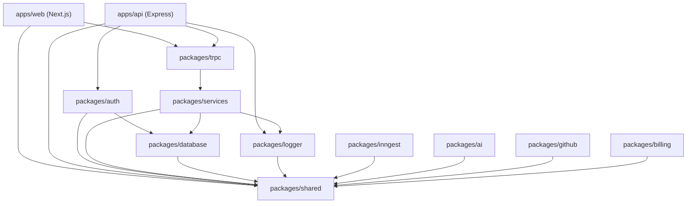
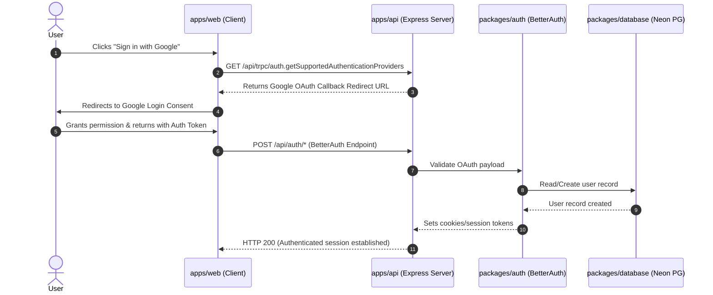
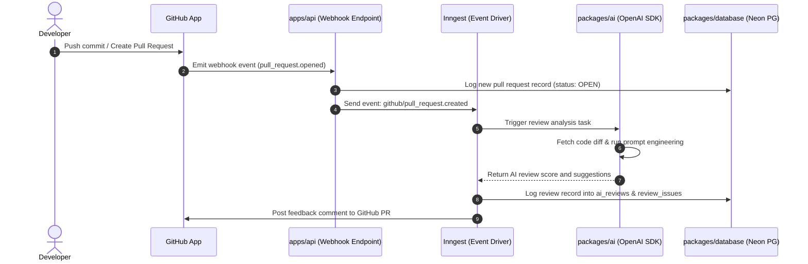
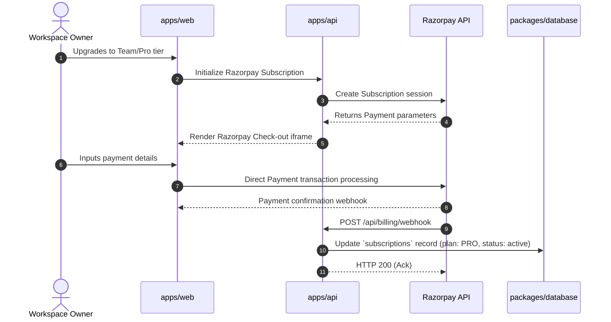
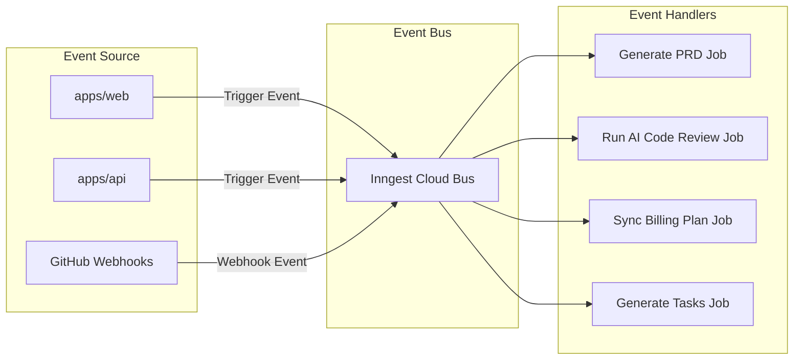

# Architecture Documentation

This document describes the codebase structure, dependency organization, data flows, and workflow integrations inside the Launchly monorepo.

---

## Monorepo Folder Structure

Launchly is organized into a modular workspace configuration powered by `pnpm` and `Turborepo`:

```
Launchly/
├── apps/
│   ├── api/             # Express API Server (tRPC + OpenAPI scalar docs)
│   └── web/             # Next.js Frontend Application
├── packages/
│   ├── ai/              # AI SDK & OpenAI models interface
│   ├── auth/            # BetterAuth identity provider
│   ├── billing/         # Payment gateways & Razorpay integrations
│   ├── database/        # Drizzle ORM definitions, schema migrations, and Neon connection client
│   ├── eslint-config/   # Linting configurations
│   ├── github/          # GitHub App webhook listeners and octokit interfaces
│   ├── inngest/         # Inngest SDK clients and event loop drivers
│   ├── logger/          # Winston-based centralized logger
│   ├── services/        # Application services & business logic orchestrators
│   ├── shared/          # Utility scripts and shared config schemas
│   ├── trpc/            # tRPC clients and backend server routers
│   └── typescript-config/# Shared TSConfigs (base.json, nextjs.json, node.json)
├── docs/                # Developer guides and system architecture documentations
├── package.json         # Workspace root configuration
└── turbo.json           # Turborepo task pipeline configuration
```

---

## Package Dependency Graph



---

## Data Flows & Core Workflows

### 1. Authentication Flow (BetterAuth)

Launchly integrates BetterAuth to authorize clients. Users authenticate via credentials or Google OAuth:



---

### 2. AI Review Workflow

When code updates are pushed, Launchly automates review evaluation via the AI SDK:



---

### 3. Subscription & Billing Flow

Launchly integrates Razorpay for tenant workspace subscription management:



---

### 4. AI Task Generation Flow (Hardened)

Task breakdowns are processed asynchronously with strict idempotency and concurrency locks:

```mermaid
sequenceDiagram
    autonumber
    actor User
    participant Web as apps/web (Kanban)
    participant API as apps/api (tRPC Router)
    participant TaskSvc as packages/services (TaskService)
    participant DB as packages/database (Neon PG)
    participant Inngest as Inngest (Event Bus)
    participant AI as packages/ai (OpenAI SDK)

    User->>Web: Clicks "Break Down Spec Into Tasks"
    Web->>API: Mutation task.generate({ prdId })
    API->>TaskSvc: triggerTaskGeneration(workspaceId, prdId)
    
    rect rgb(20, 20, 30)
        Note over TaskSvc,DB: Concurrency Protection Transaction
        TaskSvc->>DB: SELECT FOR UPDATE (Locks PRD row)
        TaskSvc->>DB: Check if any QUEUED/GENERATING audit exists
        TaskSvc->>DB: Insert new audit record (status: QUEUED, idempotencyKey)
    end
    
    TaskSvc->>Inngest: Send event: task.generate (with generationId)
    TaskSvc-->>API: Returns { success: true, generationId }
    API-->>Web: Returns response container
    
    Note over Web,API: Background Status Polling (refetchInterval: 2000ms)
    Web->>API: Query task.getGenerationStatus({ prdId })
    API-->>Web: Returns status: QUEUED

    Note over Inngest,AI: Inngest Asynchronous Execution Loop
    Inngest->>DB: Update status to GENERATING
    Inngest->>DB: Check idempotency (skip if already COMPLETED)
    Inngest->>DB: Fetch PRD details
    Inngest->>AI: Call provider.generateTasks(prdObject)
    AI-->>Inngest: Return task list array + usage metadata
    
    rect rgb(20, 20, 30)
        Note over Inngest,DB: DB Transaction
        Inngest->>DB: Insert tasks under nextVersion in engineering_tasks
    end
    
    Inngest->>DB: Update audit to COMPLETED (promptHash, responseHash, durationMs, temperature)
    
    Web->>API: Query task.getGenerationStatus({ prdId })
    API-->>Web: Returns status: COMPLETED
    Web->>API: Query task.list({ prdId, version })
    API-->>Web: Returns engineering task list
    Web->>User: Renders Kanban board with generated tasks
```



---

### 5. Background Job Loop (Inngest Workflow)

Background event loop scheduling is decoupled using Inngest event execution hooks:



---

## TypeScript ESM Resolution Rules

Launchly utilizes modern Node.js and TypeScript configurations to ensure runtime ESM compatibility:
- **Module Settings**: `"module": "NodeNext"` and `"moduleResolution": "NodeNext"` are configured in `@repo/typescript-config/base.json`.
- **Package Configuration**: Workspace packages that define `"type": "module"` utilize ESM module resolution rules under Node.
- **Import Specifiers**: In alignment with Node.js ESM standards, relative imports within these packages must use explicit `.js` file extensions:
  - ❌ `import { env } from "./env"`
  - ✅ `import { env } from "./env.js"`
  *Note: TypeScript automatically resolves the `.js` path to the underlying `.ts` source files during type-checking and compilation while remaining compatible with standard Node.js runtimes.*

---

## Workspace & Tenant Isolation Flow
All data endpoints and background jobs inside Launchly strictly enforce organization-level scoping:
1. **API Requests:** Requests entering the tRPC engine utilize the `workspaceProcedure`. This middleware inspects the user's active session, validates that the user is a registered member of the organization, and mounts the validated workspace context on `ctx.workspace.active`.
2. **Services & Database:** All database operations inside the `TaskService` construct queries using the Drizzle `and()` operator, matching the query filters with the active workspace's UUID (`organizationId`).
3. **Background Jobs:** The `task.generate` event carries both the target `prdId` and the `workspaceId`. The Inngest runner queries the database with both fields, verifying that the PRD belongs to the requesting tenant workspace before triggering any LLM operations.
