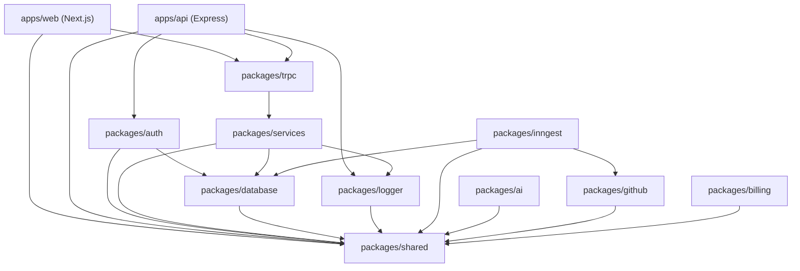
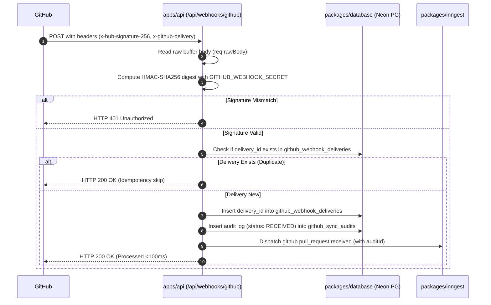
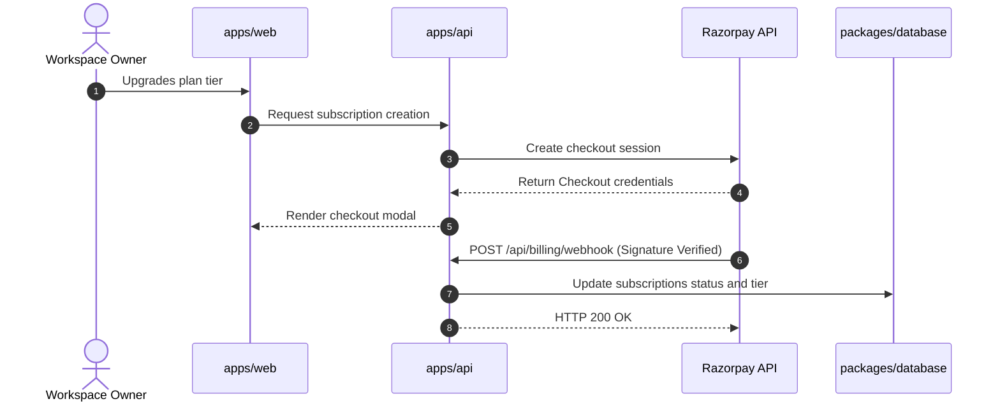
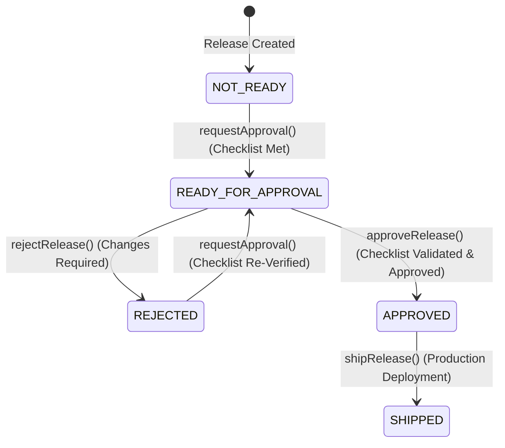

# Architecture Documentation

This document describes the codebase structure, package responsibilities, multi-tenant workspace isolation policies, ESM resolutions, data flows, and workflow integrations inside the Launchly monorepo.

---

## Monorepo Folder Structure

Launchly is organized into a modular workspace configuration powered by `pnpm` and `Turborepo`:

```
Launchly/
├── apps/
│   ├── api/             # Express API Server (tRPC, REST endpoints, and OpenAPI scalar docs)
│   └── web/             # Next.js Frontend Application (Dashboard, Kanban, and PR Views)
├── packages/
│   ├── ai/              # AI SDK wrappers (OpenAI Structured output vs Mock AI provider)
│   ├── auth/            # BetterAuth identity provider adapter and session hooks
│   ├── billing/         # Payment gateways & Razorpay integrations
│   ├── database/        # Drizzle ORM definitions, schema migrations, and Neon connection client
│   ├── eslint-config/   # Shared flat ESLint configurations
│   ├── github/          # GitHub App auth, Webhook signatures, and Octokit wrappers
│   ├── inngest/         # Inngest SDK event schemas, clients, and background handlers
│   ├── logger/          # Winston-based centralized logging service
│   ├── services/        # Consolidated database query logic and business rules handlers
│   ├── shared/          # Centralized TS types, helper utils, and Zod env validators
│   ├── trpc/            # tRPC adapters, procedures, context injection, and server routers
│   └── typescript-config/# Shared TSConfigs (base.json, nextjs.json, node.json)
├── docs/                # Developer guides and system architecture documentations
├── package.json         # Workspace root configuration
└── turbo.json           # Turborepo task pipeline configuration
```

---

## Package Dependency Graph



---

## TypeScript ESM Resolution Rules

Launchly utilizes modern Node.js and TypeScript configurations to ensure runtime ESM compatibility:
- **Module Settings**: `"module": "NodeNext"` and `"moduleResolution": "NodeNext"` are configured in `@repo/typescript-config/base.json`.
- **Package Configuration**: Workspace packages that define `"type": "module"` utilize ESM module resolution rules under Node.
- **Import Specifiers**: Relative imports within these packages must use explicit `.js` file extensions:
  - ❌ `import { env } from "./env"`
  - ✅ `import { env } from "./env.js"`

---

## Workspace & Tenant Isolation

Launchly is a secure multi-tenant SaaS application enforcing strict isolation boundaries:
1. **`workspaceProcedure`**: Every tRPC request validates that the authenticated session corresponds to a member of the active workspace. Resolvers extract the workspace context on `ctx.workspace.active.id`.
2. **Organization Scoping**: Database queries in the services layer compile with `and(eq(table.organizationId, workspaceId))` to prevent data leaks.
3. **Webhook Workspace Linking**: When a GitHub webhook event is received, the server maps the event payload's repository ID to connected workspaces in the `repositories` table. If a repository is registered to multiple workspaces, an Inngest event is triggered independently for each workspace, ensuring complete tenant boundary isolation.

---

## Core System Flows

### 1. Webhook Signature & Idempotency Flow
Before any background work is scheduled, incoming GitHub webhooks are verified and filtered to guarantee integrity and single execution:



### 2. GitHub Pull Request Ingestion Flow
Once enqueued, the Inngest runner parses files and synchronizes repository changes in the background:

```mermaid
sequenceDiagram
    autonumber
    participant Inngest as Inngest Background Runner
    participant DB as packages/database (Neon PG)
    participant GH as GitHub API (Octokit)

    Inngest->>DB: Update github_sync_audits (status: PROCESSING, retryCount: attempt)
    Inngest->>DB: Query repositories table to resolve full name
    Inngest->>DB: Initialize pull_requests row (processing_status: PROCESSING)
    Inngest->>GH: Get PR Metadata (commits, branch, base/head SHAs) via Octokit
    Inngest->>GH: Get PR Modified Files (names, additions, deletions, patches)
    Inngest->>DB: Update pull_requests details
    rect rgb(20, 20, 30)
        Note over Inngest,DB: DB Transaction (Cascade Safe)
        Inngest->>DB: Delete existing pull_request_files rows
        Inngest->>DB: Insert new pull_request_files (ignores patches >20KB to save space)
    end
    Inngest->>DB: Update pull_requests (processing_status: READY_FOR_AI_REVIEW)
    Inngest->>DB: Update github_sync_audits (status: COMPLETED, durationMs)
    Inngest->>Inngest: Emit github.pull_request.processed
```



### 3. AI Task Generation Flow (Hardened)
Engineering tasks are extracted from Product Requirement Documents (PRDs) via structured AI parsing or mock fallbacks:

```mermaid
sequenceDiagram
    autonumber
    actor User as Workspace Developer
    participant Web as apps/web (Kanban UI)
    participant API as apps/api (tRPC router)
    participant TaskSvc as packages/services (TaskService)
    participant DB as packages/database (Neon PG)
    participant Inngest as Inngest Runner
    participant AI as packages/ai (OpenAI / Mock)

    User->>Web: Clicks "Generate Tasks"
    Web->>API: Mutation task.generate({ prdId })
    API->>TaskSvc: Trigger task generation
    rect rgb(20, 20, 30)
        Note over TaskSvc,DB: Row Lock Transaction
        TaskSvc->>DB: SELECT FOR UPDATE (prd_id row)
        TaskSvc->>DB: Check for running/queued task_generation_audits
        TaskSvc->>DB: Insert new audit record (status: QUEUED)
    end
    TaskSvc->>Inngest: Send event: task.generate (with generationId)
    TaskSvc-->>API: Returns success & generationId
    API-->>Web: Return response parameters
    Note over Web,API: Web UI polls getGenerationStatus every 2000ms

    Inngest->>DB: Update audit status to GENERATING
    Inngest->>DB: Fetch PRD details
    Inngest->>AI: Call provider.generateTasks(prdObject)
    AI-->>Inngest: Return task list JSON + token usage metadata
    Inngest->>DB: Bulk insert tasks in database (nextVersion index)
    Inngest->>DB: Update audit (status: COMPLETED, hashes, durationMs)

    Web->>API: Poll getGenerationStatus -> COMPLETED
    Web->>API: Query task.list({ prdId })
    API-->>Web: Return task array
    Web-->>User: Render Kanban board with drag-and-drop support
```



### 4. Subscription & Billing Flow
Payment plans are updated automatically based on Razorpay checkout webhooks:



### 5. Release Approval, Ship Workflow & Complete Pipeline
This phase implements the full AI-assisted product delivery pipeline. Releases must pass through every gate before they can be shipped:

```
Feature Request → PRD → Engineering Tasks → GitHub PR → AI Review → Human Approval → SHIPPED
```

#### Release State Machine



#### Core Components & Validations
1. **Compliance Checklist**: Evaluates if a pull request has a linked PRD, associated engineering tasks, is synchronized, has a `COMPLETED` latest AI review, and contains 0 blocking findings (findings with `CRITICAL` or `HIGH` severity).
2. **State Machine Validation**: Validates transitions server-side inside a database transaction:
   - Target `READY_FOR_APPROVAL` is only allowed from `NOT_READY` or `REJECTED`.
   - Target `APPROVED` and `REJECTED` are only allowed from `READY_FOR_APPROVAL`.
   - Target `SHIPPED` is only allowed from `APPROVED`.
   - Any invalid transition throws a `409 Conflict` error.
3. **Approval Audit Trail** (`release_approvals`): Every request, approval, and rejection appends a new immutable row containing reviewer ID, comments, linked AI review version, and timestamp. Only human approval lifecycle events are stored here.
4. **Ship Audit Trail** (`release_ship_audits`): Every successful ship action inserts a new immutable row with `shippedBy`, `releaseVersion`, `notes`, and `shippedAt`. Ship events are deployment lifecycle events — semantically distinct from approval decisions — and are never mixed into `release_approvals`.
5. **Release Fields on Ship**: When a release is shipped, the `releases` table is updated atomically with `status=SHIPPED`, `shippedAt`, `shippedBy`, and `releaseVersion`. The `pull_requests.processingStatus` is simultaneously updated to `SHIPPED` in the same transaction.

