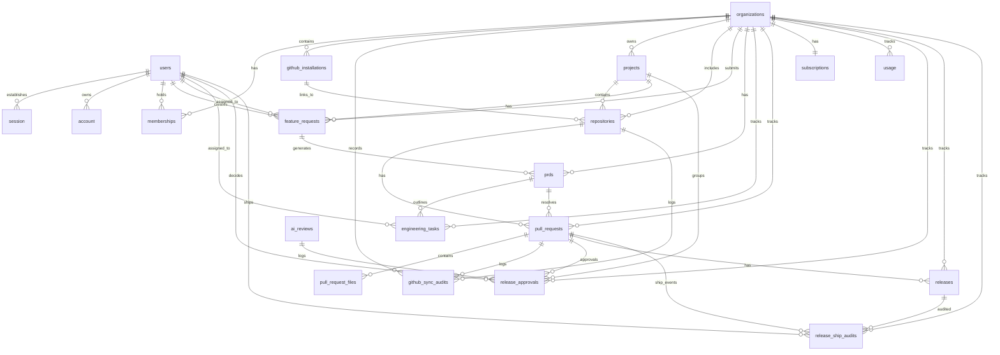

# Database Documentation

This document describes the schema, constraints, relationships, and indices of the Launchly database system, managed via **Drizzle ORM** on a Neon PostgreSQL backend.

---

## Database Overview

The Launchly database manages user accounts, multi-tenant organizations, feature requests, repositories, pull requests, files list, sync audits, developer tasks, subscription plans, and system usage logs.

---

## ER Diagram

Below is the Entity Relationship Diagram illustrating table mappings and linkages:

---

## Tables

### users
**Purpose**: Stores registered platform users.  
**Primary Key**: `id` (uuid, defaultRandom)

#### Columns
| Column | Type | Description |
|---|---|---|
| `id` | uuid | Primary key |
| `name` | text | Display name (default "") |
| `full_name` | varchar(80) | Full name |
| `email` | varchar(255) | User email |
| `email_verified` | boolean | Verified status (default false) |
| `image` | text | Avatar image URL |
| `profile_image_url` | text | Profile image URL override |
| `created_at` | timestamp | Creation timestamp |
| `updated_at` | timestamp | Update timestamp |
| `deleted_at` | timestamp | Soft-deletion timestamp |

#### Constraints & Indexes
- Unique Index: `users_email_uq_idx` on `email` where `deleted_at IS NULL`.

#### Relationships
- One-to-Many: `session`, `account`, `memberships`, `feature_requests` (as creator/assignee), `engineering_tasks`.

---

### session
**Purpose**: User session identifiers managed by BetterAuth.  
**Primary Key**: `id` (text)

#### Columns
| Column | Type | Description |
|---|---|---|
| `id` | text | Session ID |
| `expires_at` | timestamp | Expiration timestamp |
| `token` | text | Session token (unique) |
| `created_at` | timestamp | Creation timestamp |
| `updated_at` | timestamp | Update timestamp |
| `ip_address` | text | IP address of request |
| `user_agent` | text | Browser user agent |
| `user_id` | uuid | Reference to `users.id` (cascade onDelete) |

#### Constraints & Indexes
- Index: `session_user_id_idx` on `user_id`.

#### Relationships
- Many-to-One: `users`

---

### account
**Purpose**: Third-party OAuth mappings (Google Oauth, etc.) for authenticating users.  
**Primary Key**: `id` (text)

#### Columns
| Column | Type | Description |
|---|---|---|
| `id` | text | Account record ID |
| `account_id` | text | External provider account identifier |
| `provider_id` | text | OAuth provider name (e.g. "google") |
| `user_id` | uuid | Reference to `users.id` (cascade onDelete) |
| `access_token` | text | OAuth access token |
| `refresh_token` | text | OAuth refresh token |
| `id_token` | text | OpenID connect ID token |
| `access_token_expires_at` | timestamp | Access token expiration timestamp |
| `refresh_token_expires_at` | timestamp | Refresh token expiration timestamp |
| `scope` | text | Granted OAuth scopes |
| `password` | text | Encrypted password (optional fallback) |
| `created_at` | timestamp | Creation timestamp |
| `updated_at` | timestamp | Update timestamp |

#### Constraints & Indexes
- Index: `account_user_id_idx` on `user_id`.

#### Relationships
- Many-to-One: `users`

---

### verification
**Purpose**: Code/token-based verification requests (BetterAuth).  
**Primary Key**: `id` (text)

#### Columns
| Column | Type | Description |
|---|---|---|
| `id` | text | Verification record ID |
| `identifier` | text | Target identity (e.g. email address) |
| `value` | text | Token value |
| `expires_at` | timestamp | Expiration timestamp |
| `created_at` | timestamp | Creation timestamp |
| `updated_at` | timestamp | Update timestamp |

---

### organizations
**Purpose**: Multi-tenant workspace entities.  
**Primary Key**: `id` (uuid, defaultRandom)

#### Columns
| Column | Type | Description |
|---|---|---|
| `id` | uuid | Organization ID |
| `name` | varchar(255) | Name of organization |
| `slug` | varchar(255) | URL-friendly unique slug (unique) |
| `created_at` | timestamp | Creation timestamp |
| `updated_at` | timestamp | Update timestamp |
| `deleted_at` | timestamp | Soft-deletion timestamp |

#### Relationships
- One-to-Many: `memberships`, `github_installations`, `github_sync_audits`, `projects`, `repositories`, `feature_requests`, `prds`, `engineering_tasks`, `pull_requests`, `usages`.
- One-to-One: `subscriptions`

---

### memberships
**Purpose**: Assigns users to organizations with specific privileges.  
**Primary Key**: `id` (uuid, defaultRandom)

#### Columns
| Column | Type | Description |
|---|---|---|
| `id` | uuid | Membership record ID |
| `user_id` | uuid | Reference to `users.id` (cascade onDelete) |
| `organization_id` | uuid | Reference to `organizations.id` (cascade onDelete) |
| `role` | enum | Role (`OWNER`, `ADMIN`, `MEMBER`) |
| `created_at` | timestamp | Creation timestamp |
| `updated_at` | timestamp | Update timestamp |

#### Constraints & Indexes
- Index: `memberships_user_id_idx` on `user_id`.
- Index: `memberships_org_id_idx` on `organization_id`.
- Unique: `memberships_user_org_uq` on (`user_id`, `organization_id`).

#### Relationships
- Many-to-One: `users`, `organizations`

---

### github_installations
**Purpose**: Connects organizations to GitHub App integration instances.  
**Primary Key**: `id` (uuid, defaultRandom)

#### Columns
| Column | Type | Description |
|---|---|---|
| `id` | uuid | Installation record ID |
| `organization_id` | uuid | Reference to `organizations.id` (cascade onDelete) |
| `installation_id` | bigint (number) | GitHub App installation ID |
| `account_login` | varchar(255) | GitHub account login name |
| `account_type` | varchar(50) | GitHub account type (User/Organization) |
| `created_at` | timestamp | Creation timestamp |
| `updated_at` | timestamp | Update timestamp |

#### Constraints & Indexes
- Index: `github_installations_org_id_idx` on `organization_id`.
- Unique: `github_installations_org_inst_uq` on (`organization_id`, `installation_id`).

#### Relationships
- Many-to-One: `organizations`
- One-to-Many: `repositories`

---

### projects
**Purpose**: Groups related code repositories and feature requests.  
**Primary Key**: `id` (uuid, defaultRandom)

#### Columns
| Column | Type | Description |
|---|---|---|
| `id` | uuid | Project ID |
| `organization_id` | uuid | Reference to `organizations.id` (cascade onDelete) |
| `name` | varchar(255) | Name of project |
| `description` | text | Long-form description |
| `created_at` | timestamp | Creation timestamp |
| `updated_at` | timestamp | Update timestamp |
| `deleted_at` | timestamp | Soft-deletion timestamp |

#### Constraints & Indexes
- Index: `projects_org_id_idx` on `organization_id` where `deleted_at IS NULL`.

#### Relationships
- Many-to-One: `organizations`
- One-to-Many: `repositories`, `feature_requests`

---

### repositories
**Purpose**: Links specific GitHub repositories to active workspaces.  
**Primary Key**: `id` (uuid, defaultRandom)

#### Columns
| Column | Type | Description |
|---|---|---|
| `id` | uuid | Repository ID |
| `organization_id` | uuid | Reference to `organizations.id` (cascade onDelete) |
| `project_id` | uuid | Reference to `projects.id` (cascade onDelete, Nullable) |
| `github_installation_id` | uuid | Reference to `github_installations.id` (set null onDelete) |
| `name` | varchar(255) | Repository name |
| `full_name` | varchar(255) | Full GitHub repository path (`owner/repo`) |
| `github_repo_id` | bigint (number) | GitHub repository ID |
| `owner` | varchar(255) | Repository owner account name |
| `default_branch` | varchar(255) | Default branch name (e.g. `main`) |
| `private` | boolean | Privacy flag |
| `installation_id` | bigint (number) | Mapped GitHub installation ID |
| `created_at` | timestamp | Creation timestamp |
| `updated_at` | timestamp | Update timestamp |

#### Constraints & Indexes
- Index: `repositories_org_id_idx` on `organization_id`.
- Index: `repositories_project_id_idx` on `project_id`.
- Index: `repositories_github_inst_id_idx` on `github_installation_id`.
- Unique: `repositories_org_repo_uq` on (`organization_id`, `github_repo_id`).

#### Relationships
- Many-to-One: `organizations`, `projects`, `github_installations`
- One-to-Many: `pull_requests`, `github_sync_audits`

---

### feature_requests
**Purpose**: User requirements or request logs requiring PRD creation.  
**Primary Key**: `id` (uuid, defaultRandom)

#### Columns
| Column | Type | Description |
|---|---|---|
| `id` | uuid | Feature request ID |
| `organization_id` | uuid | Reference to `organizations.id` (cascade onDelete) |
| `project_id` | uuid | Reference to `projects.id` (cascade onDelete) |
| `created_by_user_id` | uuid | Creator User ID (set null onDelete) |
| `assigned_to_user_id` | uuid | Assignee User ID (set null onDelete) |
| `title` | varchar(255) | Title of feature request |
| `description` | text | Long-form feature description |
| `status` | enum | Status (`NEW`, `CLARIFICATION_REQUIRED`, `READY_FOR_PRD`, `PRD_GENERATED`, `IN_DEVELOPMENT`, `IN_REVIEW`, `READY_FOR_RELEASE`, `SHIPPED`) |
| `priority` | enum | Priority (`LOW`, `MEDIUM`, `HIGH`, `CRITICAL`) |
| `created_at` | timestamp | Creation timestamp |
| `updated_at` | timestamp | Update timestamp |
| `deleted_at` | timestamp | Soft-deletion timestamp |

#### Constraints & Indexes
- Index: `feature_requests_org_id_idx` on `organization_id` where `deleted_at IS NULL`.
- Index: `feature_requests_project_id_idx` on `project_id` where `deleted_at IS NULL`.
- Index: `feature_requests_status_idx` on `status`.

#### Relationships
- Many-to-One: `organizations`, `projects`, `users`
- One-to-Many: `prds`

---

### prds
**Purpose**: AI-generated Product Requirement Documents representing parsed feature requests.  
**Primary Key**: `id` (uuid, defaultRandom)

#### Columns
| Column | Type | Description |
|---|---|---|
| `id` | uuid | PRD record ID |
| `organization_id` | uuid | Reference to `organizations.id` (cascade onDelete) |
| `feature_request_id` | uuid | Reference to `feature_requests.id` (cascade onDelete) |
| `problem_statement` | text | Problem definition |
| `goals` | text array | Specific outcomes targeted |
| `non_goals` | text array | Explicit exclusions |
| `user_stories` | jsonb | Targeted user journeys |
| `acceptance_criteria` | text array | Pass criteria conditions |
| `edge_cases` | text array | Handled anomaly behaviors |
| `success_metrics` | text array | KPI measurements |
| `version` | integer | Revision counter (default 1) |
| `created_at` | timestamp | Creation timestamp |
| `updated_at` | timestamp | Update timestamp |

#### Constraints & Indexes
- Index: `prds_org_id_idx` on `organization_id`.
- Index: `prds_feature_request_id_idx` on `feature_request_id`.

#### Relationships
- Many-to-One: `organizations`, `feature_requests`
- One-to-Many: `engineering_tasks`, `pull_requests`, `task_generation_audits`

---

### engineering_tasks
**Purpose**: Granular task cards mapped to a specific PRD.  
**Primary Key**: `id` (uuid, defaultRandom)

#### Columns
| Column | Type | Description |
|---|---|---|
| `id` | uuid | Task ID |
| `organization_id` | uuid | Reference to `organizations.id` (cascade onDelete) |
| `prd_id` | uuid | Reference to `prds.id` (cascade onDelete) |
| `project_id` | uuid | Reference to `projects.id` (cascade onDelete) |
| `title` | varchar(255) | Name of developer task |
| `description` | text | Technical requirements / specs |
| `status` | enum | Status (`BACKLOG`, `TODO`, `IN_PROGRESS`, `IN_REVIEW`, `DONE`) |
| `assignee_id` | uuid | Assigned developer (set null onDelete) |
| `position` | integer | Positional sorting index within a status column |
| `version` | integer | Task breakdown generation version (default 1) |
| `metadata` | jsonb | AI estimations (estimate, complexity, priority, confidence, and dependencies) |
| `created_at` | timestamp | Creation timestamp |
| `updated_at` | timestamp | Update timestamp |

#### Constraints & Indexes
- Index: `engineering_tasks_org_id_idx` on `organization_id`.
- Index: `engineering_tasks_prd_id_idx` on `prd_id`.
- Index: `engineering_tasks_status_idx` on `status`.

#### Relationships
- Many-to-One: `organizations`, `prds`, `projects`, `users`

---

### task_generation_audits
**Purpose**: Logs historical, immutable AI task generation attempts.  
**Primary Key**: `id` (uuid, defaultRandom)

#### Columns
| Column | Type | Description |
|---|---|---|
| `id` | uuid | Generation ID |
| `organization_id` | uuid | Reference to `organizations.id` (cascade onDelete) |
| `prd_id` | uuid | Reference to `prds.id` (cascade onDelete) |
| `provider` | varchar(255) | AI provider name (e.g. `"openai"`, `"mock"`) |
| `model` | varchar(255) | Model variant (e.g. `"gpt-4o-mini"`) |
| `prompt_version` | varchar(255) | Prompt version variant |
| `prompt_hash` | varchar(255) | SHA-256 hash of the generated prompt input |
| `response_hash` | varchar(255) | SHA-256 hash of the generated task output JSON |
| `temperature` | real | Generation model temperature |
| `status` | enum | Run status (`NOT_STARTED`, `QUEUED`, `GENERATING`, `COMPLETED`, `FAILED`) |
| `idempotency_key` | varchar(255) | Unique idempotency checker key |
| `generated_version` | integer | Mapped engineering task version |
| `started_at` | timestamp | Run initialization timestamp |
| `completed_at` | timestamp | Run termination timestamp |
| `duration_ms` | integer | Generation execution duration |
| `token_usage` | jsonb | Token footprint metadata |
| `error` | text | Captured exception error string |

#### Constraints & Indexes
- Index: `task_generation_audits_org_id_idx` on `organization_id`.
- Index: `task_generation_audits_prd_id_idx` on `prd_id`.

#### Relationships
- Many-to-One: `organizations`, `prds`

---

### pull_requests
**Purpose**: Pull requests fetched/synchronized from connected GitHub repositories.  
**Primary Key**: `id` (uuid, defaultRandom)

#### Columns
| Column | Type | Description |
|---|---|---|
| `id` | uuid | Pull Request ID |
| `organization_id` | uuid | Reference to `organizations.id` (cascade onDelete) |
| `prd_id` | uuid | Reference to `prds.id` (restrict onDelete, Nullable) |
| `repository_id` | uuid | Reference to `repositories.id` (cascade onDelete) |
| `github_pr_id` | bigint (number) | GitHub Pull Request database ID |
| `number` | integer | Pull request sequence number on GitHub |
| `title` | varchar(255) | Title of the pull request |
| `branch` | varchar(255) | Head/source branch name |
| `base_branch` | varchar(255) | Base/target branch name |
| `head_sha` | varchar(40) | Latest commit SHA of head branch |
| `base_sha` | varchar(40) | SHA of base branch head when PR was created |
| `state` | varchar(50) | State on GitHub (`open`, `closed`, `merged`) |
| `author` | varchar(255) | Login handle of PR creator |
| `url` | varchar(512) | HTML address of the pull request |
| `merged_at` | timestamp | Merger timestamp |
| `status` | enum | Status (`OPEN`, `CHANGES_REQUESTED`, `APPROVED`, `MERGED`) |
| `processing_status` | enum | Integration lifecycle status (`RECEIVED`, `PROCESSING`, `READY_FOR_AI_REVIEW`, `FAILED`, `AI_REVIEWING`, `AI_REVIEW_COMPLETED`, `HUMAN_APPROVED`, `SHIPPED`) |
| `created_at` | timestamp | Creation timestamp |
| `updated_at` | timestamp | Update timestamp |

#### Constraints & Indexes
- Index: `pull_requests_org_id_idx` on `organization_id`.
- Index: `pull_requests_prd_id_idx` on `prd_id`.
- Index: `pull_requests_status_idx` on `status`.
- Unique: `pull_requests_org_pr_uq` on (`organization_id`, `github_pr_id`).

#### Relationships
- Many-to-One: `organizations`, `prds`, `repositories`
- One-to-Many: `pull_request_files`, `github_sync_audits`

---

### pull_request_files
**Purpose**: Stores list of file modifications inside individual pull requests.  
**Primary Key**: `id` (uuid, defaultRandom)

#### Columns
| Column | Type | Description |
|---|---|---|
| `id` | uuid | File record ID |
| `pull_request_id` | uuid | Reference to `pull_requests.id` (cascade onDelete) |
| `filename` | varchar(512) | Source file path |
| `status` | varchar(50) | Status (`added`, `modified`, `removed`) |
| `additions` | integer | Lines added count |
| `deletions` | integer | Lines deleted count |
| `changes` | integer | Total line changes count |
| `patch` | text | Patch contents (stored only for files <20KB, otherwise Null) |

#### Relationships
- Many-to-One: `pull_requests`

---

### github_webhook_deliveries
**Purpose**: Stores webhook delivery UUIDs to prevent processing the same webhook event more than once.  
**Primary Key**: `id` (varchar, literal delivery UUID)

#### Columns
| Column | Type | Description |
|---|---|---|
| `id` | varchar | GitHub header `X-GitHub-Delivery` ID |
| `event_type` | varchar(100) | Event type (e.g. `pull_request`, `installation`) |
| `processed_at` | timestamp | Processed timestamp |

---

### github_sync_audits
**Purpose**: Logs executions and processing metrics of incoming webhooks.  
**Primary Key**: `id` (uuid, defaultRandom)

#### Columns
| Column | Type | Description |
|---|---|---|
| `id` | uuid | Audit log ID |
| `organization_id` | uuid | Reference to `organizations.id` (cascade onDelete) |
| `repository_id` | uuid | Reference to `repositories.id` (cascade onDelete, Nullable) |
| `pull_request_id` | uuid | Reference to `pull_requests.id` (set null onDelete, Nullable) |
| `delivery_id` | varchar(255) | Delivery UUID matching `github_webhook_deliveries` |
| `event` | varchar(100) | Webhook action text (e.g. `pull_request.opened`) |
| `status` | varchar(50) | Exec state (`RECEIVED`, `PROCESSING`, `COMPLETED`, `FAILED`) |
| `started_at` | timestamp | Start timestamp (default now) |
| `completed_at` | timestamp | Completion timestamp |
| `duration_ms` | integer | Execution runtime duration |
| `retry_count` | integer | Current retry attempt index (0 for first execution) |
| `error` | varchar(2048) | Exception details (if status is FAILED) |

#### Constraints & Indexes
- Index: `github_sync_audits_org_id_idx` on `organization_id`.
- Index: `github_sync_audits_repo_id_idx` on `repository_id`.
- Index: `github_sync_audits_pr_id_idx` on `pull_request_id`.
- Index: `github_sync_audits_delivery_id_idx` on `delivery_id`.

#### Relationships
- Many-to-One: `organizations`, `repositories`, `pull_requests`

---

### subscriptions
**Purpose**: Plan tiers and subscription tracking states.  
**Primary Key**: `id` (uuid, defaultRandom)

#### Columns
| Column | Type | Description |
|---|---|---|
| `id` | uuid | Subscription record ID |
| `organization_id` | uuid | Reference to `organizations.id` (cascade onDelete) |
| `plan` | enum | Plan tier (`FREE`, `PRO`, `TEAM`) |
| `status` | varchar(50) | Payment status |
| `provider` | varchar(50) | Provider name (e.g. `RAZORPAY`) |
| `provider_subscription_id` | varchar(255) | Provider's entity ID |
| `provider_customer_id` | varchar(255) | Provider customer profile ID |
| `provider_plan_id` | varchar(255) | Provider plan template ID |
| `current_period_end` | timestamp | Billing period end timestamp |
| `created_at` | timestamp | Creation timestamp |
| `updated_at` | timestamp | Update timestamp |

#### Constraints & Indexes
- Index: `subscriptions_org_id_idx` on `organization_id`.
- Unique: `subscriptions_org_prov_sub_uq` on (`organization_id`, `provider_subscription_id`).

#### Relationships
- Many-to-One: `organizations` (One-to-One mapping)

---

### usage
**Purpose**: System usages logged for billing calculations.  
**Primary Key**: `id` (uuid, defaultRandom)

#### Columns
| Column | Type | Description |
|---|---|---|
| `id` | uuid | Usage log ID |
| `organization_id` | uuid | Reference to `organizations.id` (cascade onDelete) |
| `metric` | varchar(100) | Metric name (e.g. `AI_TOKENS`) |
| `quantity` | integer | Quantity log value |
| `recorded_at` | timestamp | Timestamp of logs |

#### Constraints & Indexes
- Index: `usage_org_id_idx` on `organization_id`.
- Index: `usage_metric_idx` on `metric`.

#### Relationships
- Many-to-One: `organizations`

---

### release_approvals
**Purpose**: Immutable append-only audit log for human approval lifecycle events only (request, approve, reject). Ship events are stored separately in `release_ship_audits`. Records are never updated or deleted.  
**Primary Key**: `id` (uuid, defaultRandom)

#### Columns
| Column | Type | Description |
|---|---|---|
| `id` | uuid | Primary key |
| `organization_id` | uuid | Reference to `organizations.id` (cascade onDelete) |
| `project_id` | uuid | Reference to `projects.id` (cascade onDelete) |
| `pull_request_id` | uuid | Reference to `pull_requests.id` (cascade onDelete) |
| `review_id` | uuid | Reference to `ai_reviews.id` (set null onDelete) |
| `review_version` | integer | Associated AI review version when action was taken |
| `approved_by` | uuid | Reference to `users.id` (set null onDelete, user who approved/rejected) |
| `status` | enum | Decision status (`PENDING`, `APPROVED`, `REJECTED`) |
| `comments` | text | Rejection or approval notes |
| `created_at` | timestamp | Creation/Log timestamp |
| `updated_at` | timestamp | Update timestamp |

#### Constraints & Indexes
- Index: `release_approvals_org_id_idx` on `organization_id`.
- Index: `release_approvals_pull_request_id_idx` on `pull_request_id`.
- Index: `release_approvals_status_idx` on `status`.

#### Relationships
- Many-to-One: `organizations`, `projects`, `pull_requests`, `ai_reviews`, `users`

---

### releases
**Purpose**: Tracks the lifecycle state of a release for a pull request. Updated atomically with ship metadata when shipped.  
**Primary Key**: `id` (uuid, defaultRandom)

#### Columns
| Column | Type | Description |
|---|---|---|
| `id` | uuid | Primary key |
| `organization_id` | uuid | Reference to `organizations.id` (cascade onDelete) |
| `pull_request_id` | uuid | Reference to `pull_requests.id` (restrict onDelete) |
| `version` | varchar(100) | Internal version tag (default: `v{pr.number}`) |
| `status` | enum | Release status (`NOT_READY`, `READY_FOR_APPROVAL`, `APPROVED`, `SHIPPED`, `REJECTED`) |
| `shipped_at` | timestamp | Timestamp when the release was shipped (nullable) |
| `shipped_by` | uuid | Reference to `users.id` (set null onDelete) — user who shipped (nullable) |
| `release_version` | varchar(100) | Human-readable version tag e.g. `v1.2.3` (nullable) |
| `created_at` | timestamp | Creation timestamp |
| `updated_at` | timestamp | Update timestamp |

#### Constraints & Indexes
- Index: `releases_org_id_idx` on `organization_id`.
- Index: `releases_pull_request_id_idx` on `pull_request_id`.
- Index: `releases_status_idx` on `status`.

#### Relationships
- Many-to-One: `organizations`, `pull_requests`, `users` (shippedByUser)
- One-to-Many: `release_ship_audits`

---

### release_ship_audits
**Purpose**: Dedicated immutable audit log for release ship events. Semantically separate from `release_approvals` (which records human approval decisions). Every call to `shipRelease()` inserts one row. Records are never updated or deleted.  
**Primary Key**: `id` (uuid, defaultRandom)

#### Columns
| Column | Type | Description |
|---|---|---|
| `id` | uuid | Primary key |
| `organization_id` | uuid | Reference to `organizations.id` (cascade onDelete) |
| `release_id` | uuid | Reference to `releases.id` (restrict onDelete) |
| `pull_request_id` | uuid | Reference to `pull_requests.id` (restrict onDelete) |
| `shipped_by` | uuid | Reference to `users.id` (set null onDelete) — actor who triggered ship |
| `release_version` | varchar(100) | Version tag captured at ship time (nullable) |
| `notes` | text | Optional release notes (nullable) |
| `shipped_at` | timestamp | Immutable ship timestamp (default now()) |

#### Constraints & Indexes
- Index: `release_ship_audits_org_id_idx` on `organization_id`.
- Index: `release_ship_audits_release_id_idx` on `release_id`.
- Index: `release_ship_audits_pull_request_id_idx` on `pull_request_id`.
- Index: `release_ship_audits_shipped_at_idx` on `shipped_at`.

#### Relationships
- Many-to-One: `organizations`, `releases`, `pull_requests`, `users` (shippedByUser)

#### Design Rationale
Ship events represent **deployment lifecycle events**, not approval decisions. Mixing them into `release_approvals` would make the audit trail semantically incorrect and harder to query independently. The dedicated table also allows the ship audit to carry ship-specific fields (`notes`, `release_version`) without polluting the approval schema.
