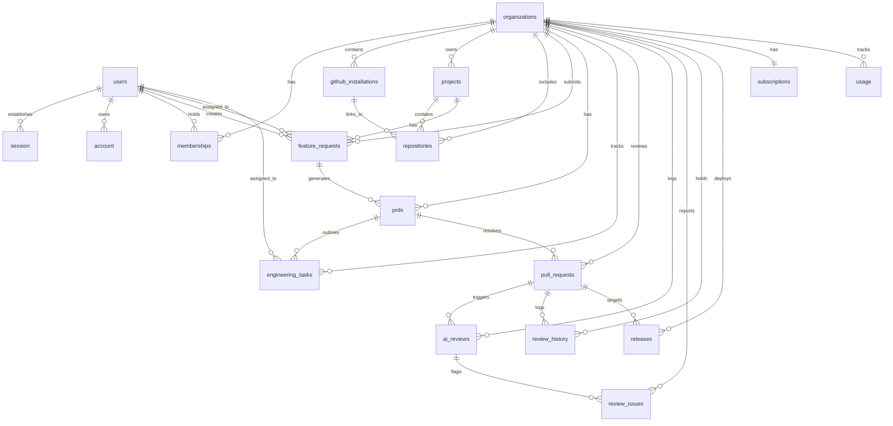

# Database Documentation

This document describes the schema, constraints, relationships, and indices of the Launchly database system, managed via **Drizzle ORM** on a Neon PostgreSQL backend.

---

## Database Overview

The Launchly database manages user accounts, multi-tenant organizations, feature requests, pull requests, AI automated reviews, developer tasks, subscription plans, and system usage.

---

## ER Diagram

Below is the Entity Relationship Diagram illustrating table mappings and linkages:

---

## Tables

### users
**Purpose**: Stores registered platform users.  
**Primary Key**: `id` (uuid, defaultRandom)

#### Columns
| Column | Type | Description |
|---|---|---|
| `id` | uuid | Primary key |
| `name` | text | Display name (default "") |
| `full_name` | varchar(80) | Full name |
| `email` | varchar(255) | User email |
| `email_verified` | boolean | Verified status (default false) |
| `image` | text | Avatar image URL |
| `profile_image_url` | text | Profile image URL override |
| `created_at` | timestamp | Creation timestamp |
| `updated_at` | timestamp | Update timestamp |
| `deleted_at` | timestamp | Soft-deletion timestamp |

#### Constraints & Indexes
- Unique Index: `users_email_uq_idx` on `email` where `deleted_at IS NULL`.

#### Relationships
- One-to-Many: `session`, `account`, `memberships`, `feature_requests` (as creator/assignee), `engineering_tasks`.

---

### session
**Purpose**: User session identifiers managed by BetterAuth.  
**Primary Key**: `id` (text)

#### Columns
| Column | Type | Description |
|---|---|---|
| `id` | text | Session ID |
| `expires_at` | timestamp | Expiration timestamp |
| `token` | text | Session token (unique) |
| `created_at` | timestamp | Creation timestamp |
| `updated_at` | timestamp | Update timestamp |
| `ip_address` | text | IP address of request |
| `user_agent` | text | Browser user agent |
| `user_id` | uuid | Reference to `users.id` (cascade onDelete) |

#### Constraints & Indexes
- Index: `session_user_id_idx` on `user_id`.

#### Relationships
- Many-to-One: `users`

---

### account
**Purpose**: Third-party OAuth mappings (Google Oauth, etc.) for authenticating users.  
**Primary Key**: `id` (text)

#### Columns
| Column | Type | Description |
|---|---|---|
| `id` | text | Account record ID |
| `account_id` | text | External provider account identifier |
| `provider_id` | text | OAuth provider name (e.g. "google") |
| `user_id` | uuid | Reference to `users.id` (cascade onDelete) |
| `access_token` | text | OAuth access token |
| `refresh_token` | text | OAuth refresh token |
| `id_token` | text | OpenID connect ID token |
| `access_token_expires_at` | timestamp | Access token expiration timestamp |
| `refresh_token_expires_at` | timestamp | Refresh token expiration timestamp |
| `scope` | text | Granted OAuth scopes |
| `password` | text | Encrypted password (optional fallback) |
| `created_at` | timestamp | Creation timestamp |
| `updated_at` | timestamp | Update timestamp |

#### Constraints & Indexes
- Index: `account_user_id_idx` on `user_id`.

#### Relationships
- Many-to-One: `users`

---

### verification
**Purpose**: Code/token-based verification requests (BetterAuth).  
**Primary Key**: `id` (text)

#### Columns
| Column | Type | Description |
|---|---|---|
| `id` | text | Verification record ID |
| `identifier` | text | Target identity (e.g. email address) |
| `value` | text | Token value |
| `expires_at` | timestamp | Expiration timestamp |
| `created_at` | timestamp | Creation timestamp |
| `updated_at` | timestamp | Update timestamp |

---

### organizations
**Purpose**: Multi-tenant workspace entities.  
**Primary Key**: `id` (uuid, defaultRandom)

#### Columns
| Column | Type | Description |
|---|---|---|
| `id` | uuid | Organization ID |
| `name` | varchar(255) | Name of organization |
| `slug` | varchar(255) | URL-friendly unique slug (unique) |
| `created_at` | timestamp | Creation timestamp |
| `updated_at` | timestamp | Update timestamp |
| `deleted_at` | timestamp | Soft-deletion timestamp |

#### Relationships
- One-to-Many: `memberships`, `github_installations`, `projects`, `repositories`, `feature_requests`, `prds`, `engineering_tasks`, `pull_requests`, `ai_reviews`, `review_issues`, `review_history`, `releases`, `usage`.
- One-to-One: `subscriptions`

---

### memberships
**Purpose**: Assigns users to organizations with specific privileges.  
**Primary Key**: `id` (uuid, defaultRandom)

#### Columns
| Column | Type | Description |
|---|---|---|
| `id` | uuid | Membership record ID |
| `user_id` | uuid | Reference to `users.id` (cascade onDelete) |
| `organization_id` | uuid | Reference to `organizations.id` (cascade onDelete) |
| `role` | enum | Role (`OWNER`, `ADMIN`, `MEMBER`) |
| `created_at` | timestamp | Creation timestamp |
| `updated_at` | timestamp | Update timestamp |

#### Constraints & Indexes
- Index: `memberships_user_id_idx` on `user_id`.
- Index: `memberships_org_id_idx` on `organization_id`.
- Unique: `memberships_user_org_uq` on (`user_id`, `organization_id`).

#### Relationships
- Many-to-One: `users`, `organizations`

---

### github_installations
**Purpose**: Connects organizations to GitHub App integration instances.  
**Primary Key**: `id` (uuid, defaultRandom)

#### Columns
| Column | Type | Description |
|---|---|---|
| `id` | uuid | Installation record ID |
| `organization_id` | uuid | Reference to `organizations.id` (cascade onDelete) |
| `installation_id` | bigint (number) | GitHub App installation ID |
| `account_login` | varchar(255) | GitHub account slug |
| `account_type` | varchar(50) | GitHub account type (User/Organization) |
| `created_at` | timestamp | Creation timestamp |
| `updated_at` | timestamp | Update timestamp |

#### Constraints & Indexes
- Index: `github_installations_org_id_idx` on `organization_id`.
- Unique: `github_installations_org_inst_uq` on (`organization_id`, `installation_id`).

#### Relationships
- Many-to-One: `organizations`
- One-to-Many: `repositories`

---

### projects
**Purpose**: Groups related code repositories and feature requests.  
**Primary Key**: `id` (uuid, defaultRandom)

#### Columns
| Column | Type | Description |
|---|---|---|
| `id` | uuid | Project ID |
| `organization_id` | uuid | Reference to `organizations.id` (cascade onDelete) |
| `name` | varchar(255) | Name of project |
| `description` | text | Long-form description |
| `created_at` | timestamp | Creation timestamp |
| `updated_at` | timestamp | Update timestamp |
| `deleted_at` | timestamp | Soft-deletion timestamp |

#### Constraints & Indexes
- Index: `projects_org_id_idx` on `organization_id` where `deleted_at IS NULL`.

#### Relationships
- Many-to-One: `organizations`
- One-to-Many: `repositories`, `feature_requests`

---

### repositories
**Purpose**: Links specific GitHub repositories to active Launchly projects.  
**Primary Key**: `id` (uuid, defaultRandom)

#### Columns
| Column | Type | Description |
|---|---|---|
| `id` | uuid | Repository ID |
| `organization_id` | uuid | Reference to `organizations.id` (cascade onDelete) |
| `project_id` | uuid | Reference to `projects.id` (cascade onDelete) |
| `github_installation_id` | uuid | Reference to `github_installations.id` (set null onDelete) |
| `name` | varchar(255) | Repository name |
| `full_name` | varchar(255) | Full GitHub repository pathway (`owner/repo`) |
| `github_repo_id` | bigint (number) | GitHub repository identifier |
| `created_at` | timestamp | Creation timestamp |
| `updated_at` | timestamp | Update timestamp |

#### Constraints & Indexes
- Index: `repositories_org_id_idx` on `organization_id`.
- Index: `repositories_project_id_idx` on `project_id`.
- Index: `repositories_github_inst_id_idx` on `github_installation_id`.
- Unique: `repositories_org_repo_uq` on (`organization_id`, `github_repo_id`).

#### Relationships
- Many-to-One: `organizations`, `projects`, `github_installations`

---

### feature_requests
**Purpose**: Client-facing feedback or request logs requiring PRD creation.  
**Primary Key**: `id` (uuid, defaultRandom)

#### Columns
| Column | Type | Description |
|---|---|---|
| `id` | uuid | Feature request ID |
| `organization_id` | uuid | Reference to `organizations.id` (cascade onDelete) |
| `project_id` | uuid | Reference to `projects.id` (cascade onDelete) |
| `created_by_user_id` | uuid | Creator User ID (set null onDelete) |
| `assigned_to_user_id` | uuid | Assignee User ID (set null onDelete) |
| `title` | varchar(255) | Title of feature request |
| `description` | text | Long-form feature description |
| `status` | enum | Status (`NEW`, `CLARIFICATION_REQUIRED`, `READY_FOR_PRD`, `PRD_GENERATED`, `IN_DEVELOPMENT`, `IN_REVIEW`, `READY_FOR_RELEASE`, `SHIPPED`) |
| `priority` | enum | Priority (`LOW`, `MEDIUM`, `HIGH`, `CRITICAL`) |
| `created_at` | timestamp | Creation timestamp |
| `updated_at` | timestamp | Update timestamp |
| `deleted_at` | timestamp | Soft-deletion timestamp |

#### Constraints & Indexes
- Index: `feature_requests_org_id_idx` on `organization_id` where `deleted_at IS NULL`.
- Index: `feature_requests_project_id_idx` on `project_id` where `deleted_at IS NULL`.
- Index: `feature_requests_status_idx` on `status`.
- Index: `feature_requests_created_by_idx` on `created_by_user_id`.
- Index: `feature_requests_assigned_to_idx` on `assigned_to_user_id`.
- Index: `feature_requests_priority_idx` on `priority`.

#### Relationships
- Many-to-One: `organizations`, `projects`, `users`
- One-to-Many: `prds`

---

### prds
**Purpose**: AI-generated Product Requirement Documents representing parsed feature requests.  
**Primary Key**: `id` (uuid, defaultRandom)

#### Columns
| Column | Type | Description |
|---|---|---|
| `id` | uuid | PRD record ID |
| `organization_id` | uuid | Reference to `organizations.id` (cascade onDelete) |
| `feature_request_id` | uuid | Reference to `feature_requests.id` (cascade onDelete) |
| `problem_statement` | text | Problem definition |
| `goals` | text array | Specific outcomes targeted |
| `non_goals` | text array | Explicit exclusions |
| `user_stories` | jsonb | Targeted user journeys |
| `acceptance_criteria` | text array | Pass criteria conditions |
| `edge_cases` | text array | Handled anomaly behaviors |
| `success_metrics` | text array | KPI measurements |
| `version` | integer | Revision counter (default 1) |
| `created_at` | timestamp | Creation timestamp |
| `updated_at` | timestamp | Update timestamp |

#### Constraints & Indexes
- Index: `prds_org_id_idx` on `organization_id`.
- Index: `prds_feature_request_id_idx` on `feature_request_id`.

#### Relationships
- Many-to-One: `organizations`, `feature_requests`
- One-to-Many: `engineering_tasks`, `pull_requests`

---

### engineering_tasks
**Purpose**: Granular deliverables mapped to a specific PRD.  
**Primary Key**: `id` (uuid, defaultRandom)

#### Columns
| Column | Type | Description |
|---|---|---|
| `id` | uuid | Task ID |
| `organization_id` | uuid | Reference to `organizations.id` (cascade onDelete) |
| `prd_id` | uuid | Reference to `prds.id` (cascade onDelete) |
| `title` | varchar(255) | Name of developer task |
| `description` | text | Technical requirements / specs |
| `status` | enum | Status (`TODO`, `IN_PROGRESS`, `IN_REVIEW`, `DONE`) |
| `assignee_id` | uuid | Assigned developer (set null onDelete) |
| `created_at` | timestamp | Creation timestamp |
| `updated_at` | timestamp | Update timestamp |

#### Constraints & Indexes
- Index: `engineering_tasks_org_id_idx` on `organization_id`.
- Index: `engineering_tasks_prd_id_idx` on `prd_id`.
- Index: `engineering_tasks_status_idx` on `status`.
- Index: `engineering_tasks_assignee_id_idx` on `assignee_id`.

#### Relationships
- Many-to-One: `organizations`, `prds`, `users`

---

### pull_requests
**Purpose**: Code integration submissions resolving specific features/PRDs.  
**Primary Key**: `id` (uuid, defaultRandom)

#### Columns
| Column | Type | Description |
|---|---|---|
| `id` | uuid | Pull Request ID |
| `organization_id` | uuid | Reference to `organizations.id` (cascade onDelete) |
| `prd_id` | uuid | Reference to `prds.id` (restrict onDelete) |
| `github_pr_id` | bigint (number) | GitHub PR entity ID |
| `number` | integer | PR sequence number on GitHub |
| `title` | varchar(255) | Header of pull request |
| `branch` | varchar(255) | Source branch name |
| `base_branch` | varchar(255) | Target branch name |
| `head_sha` | varchar(40) | Latest commit hash |
| `merged_at` | timestamp | Merger completion time |
| `status` | enum | Status (`OPEN`, `CHANGES_REQUESTED`, `APPROVED`, `MERGED`) |
| `created_at` | timestamp | Creation timestamp |
| `updated_at` | timestamp | Update timestamp |

#### Constraints & Indexes
- Index: `pull_requests_org_id_idx` on `organization_id`.
- Index: `pull_requests_prd_id_idx` on `prd_id`.
- Index: `pull_requests_status_idx` on `status`.
- Unique: `pull_requests_org_pr_uq` on (`organization_id`, `github_pr_id`).

#### Relationships
- Many-to-One: `organizations`, `prds`
- One-to-Many: `ai_reviews`, `review_history`, `releases`

---

### ai_reviews
**Purpose**: Automated AI reviews triggered on PR codebase commits.  
**Primary Key**: `id` (uuid, defaultRandom)

#### Columns
| Column | Type | Description |
|---|---|---|
| `id` | uuid | AI review record ID |
| `organization_id` | uuid | Reference to `organizations.id` (cascade onDelete) |
| `pull_request_id` | uuid | Reference to `pull_requests.id` (cascade onDelete) |
| `commit_sha` | varchar(40) | Evaluated commit hash |
| `status` | enum | Process state (`PENDING`, `COMPLETED`, `FAILED`) |
| `score` | integer | Code rating score |
| `summary` | text | Overall feedback summary |
| `model` | varchar(100) | Generative LLM version used |
| `tokens_used` | integer | AI api tokens consumed |
| `duration_ms` | integer | Processing time (ms) |
| `created_at` | timestamp | Creation timestamp |
| `updated_at` | timestamp | Update timestamp |

#### Constraints & Indexes
- Index: `ai_reviews_org_id_idx` on `organization_id`.
- Index: `ai_reviews_pull_request_id_idx` on `pull_request_id`.
- Index: `ai_reviews_status_idx` on `status`.

#### Relationships
- Many-to-One: `organizations`, `pull_requests`
- One-to-Many: `review_issues`

---

### review_issues
**Purpose**: Specific items/code modifications flagged during AI reviews.  
**Primary Key**: `id` (uuid, defaultRandom)

#### Columns
| Column | Type | Description |
|---|---|---|
| `id` | uuid | Issue identifier |
| `organization_id` | uuid | Reference to `organizations.id` (cascade onDelete) |
| `ai_review_id` | uuid | Reference to `ai_reviews.id` (cascade onDelete) |
| `file_path` | varchar(255) | Source file path containing the issue |
| `line_number` | integer | Specific line flagged |
| `message` | text | Issue details |
| `severity` | enum | Severity (`BLOCKING`, `NON_BLOCKING`) |
| `rule` | varchar(100) | Flagged rule name |
| `suggestion` | text | Recommended code diff/fix |
| `resolved` | boolean | Resolution status (default false) |
| `resolved_at` | timestamp | Resolution completion time |
| `created_at` | timestamp | Creation timestamp |
| `updated_at` | timestamp | Update timestamp |

#### Constraints & Indexes
- Index: `review_issues_org_id_idx` on `organization_id`.
- Index: `review_issues_ai_review_id_idx` on `ai_review_id`.
- Index: `review_issues_severity_idx` on `severity`.
- Index: `review_issues_resolved_idx` on `resolved`.

#### Relationships
- Many-to-One: `organizations`, `ai_reviews`

---

### review_history
**Purpose**: Logs historical developer actions on PR reviews.  
**Primary Key**: `id` (uuid, defaultRandom)

#### Columns
| Column | Type | Description |
|---|---|---|
| `id` | uuid | History log ID |
| `organization_id` | uuid | Reference to `organizations.id` (cascade onDelete) |
| `pull_request_id` | uuid | Reference to `pull_requests.id` (cascade onDelete) |
| `action` | varchar(100) | Action description (e.g. "PR_CREATED", "REVIEW_SUBMITTED") |
| `metadata` | jsonb | Auxiliary data parameters |
| `created_at` | timestamp | Log creation timestamp |

#### Constraints & Indexes
- Index: `review_history_org_id_idx` on `organization_id`.
- Index: `review_history_pull_request_id_idx` on `pull_request_id`.

#### Relationships
- Many-to-One: `organizations`, `pull_requests`

---

### releases
**Purpose**: Manages release statuses generated from pull requests.  
**Primary Key**: `id` (uuid, defaultRandom)

#### Columns
| Column | Type | Description |
|---|---|---|
| `id` | uuid | Release ID |
| `organization_id` | uuid | Reference to `organizations.id` (cascade onDelete) |
| `pull_request_id` | uuid | Reference to `pull_requests.id` (restrict onDelete) |
| `version` | varchar(100) | Version release string |
| `status` | enum | Status (`PENDING`, `APPROVED`, `SHIPPED`) |
| `created_at` | timestamp | Creation timestamp |
| `updated_at` | timestamp | Update timestamp |

#### Constraints & Indexes
- Index: `releases_org_id_idx` on `organization_id`.
- Index: `releases_pull_request_id_idx` on `pull_request_id`.
- Index: `releases_status_idx` on `status`.

#### Relationships
- Many-to-One: `organizations`, `pull_requests`

---

### subscriptions
**Purpose**: Payment tier and state mappings for workspace billing.  
**Primary Key**: `id` (uuid, defaultRandom)

#### Columns
| Column | Type | Description |
|---|---|---|
| `id` | uuid | Subscription record ID |
| `organization_id` | uuid | Reference to `organizations.id` (cascade onDelete) |
| `plan` | enum | Plan tier (`FREE`, `PRO`, `TEAM` - default `FREE`) |
| `status` | varchar(50) | Payment status |
| `provider` | varchar(50) | Payment provider (e.g. "RAZORPAY") |
| `provider_subscription_id` | varchar(255) | Provider's subscription entity ID |
| `provider_customer_id` | varchar(255) | Provider customer profile ID |
| `provider_plan_id` | varchar(255) | Provider plan template ID |
| `current_period_end` | timestamp | Billing period end timestamp |
| `created_at` | timestamp | Creation timestamp |
| `updated_at` | timestamp | Update timestamp |

#### Constraints & Indexes
- Index: `subscriptions_org_id_idx` on `organization_id`.
- Index: `subscriptions_prov_sub_id_idx` on `provider_subscription_id`.
- Unique: `subscriptions_org_prov_sub_uq` on (`organization_id`, `provider_subscription_id`).

#### Relationships
- Many-to-One: `organizations` (One-to-One mapping)

---

### usage
**Purpose**: Tracks workspace system usage for metered billing.  
**Primary Key**: `id` (uuid, defaultRandom)

#### Columns
| Column | Type | Description |
|---|---|---|
| `id` | uuid | Usage log ID |
| `organization_id` | uuid | Reference to `organizations.id` (cascade onDelete) |
| `metric` | varchar(100) | Metric identifier (e.g. "AI_TOKENS", "PULL_REQUESTS") |
| `quantity` | integer | Measured amount |
| `recorded_at` | timestamp | Measurement timestamp |

#### Constraints & Indexes
- Index: `usage_org_id_idx` on `organization_id`.
- Index: `usage_metric_idx` on `metric`.

#### Relationships
- Many-to-One: `organizations`
